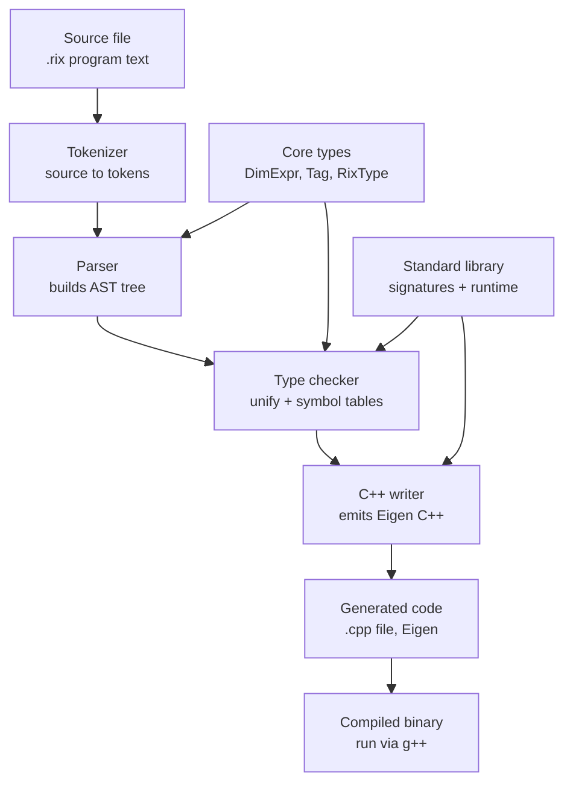

# Rix-Compiler

Rix

A statically-shape-checked matrix language for quantitative finance, compiling to C++ (Eigen).

What is Rix?

Rix catches an entire class of bug that plain C++/numpy/Eigen can't: code that's structurally valid but semantically wrong. cov(prices) — computing a covariance matrix directly on price levels instead of returns — runs fine in most languages and produces a quietly wrong number. In Rix, Prices and Returns are distinct types, even when their numeric shape is identical, so that call is a compile error.

rix:
let prices: Matrix<Prices, 252, 3> = load_csv("universe.csv")
let bad = cov(prices)

error: cov() expects Matrix<Returns,T,N>, found Matrix<Prices,252,3>
note: Prices and Returns are distinct tags — did you mean pct_change(prices)?

Key ideas
Nominal tags (Prices, Returns, CovMatrix, ...) — two matrices with identical shape but different meaning are different types.
Symbolic, statically-checked shapes — Matrix<Returns, T-1, N> is checked at compile time via unification, not just at runtime.
Compiles to real C++ — DimExpr maps to Eigen's fixed-size template parameters, so shape checks disappear entirely by the time the code runs; tags cost nothing at runtime, since they're erased during codegen.
A stdlib built for quant work — covariance, correlation, EWMA, rolling windows, Cholesky, portfolio construction, and more, each with a signature that only accepts the inputs that actually make sense.

Rix Compiler Architecture  




Example Code 

```rix
func daily_risk_report(prices: Matrix<Prices,252,10>, returns: Matrix<Returns,251,10>) -> Void {
    let vol: Matrix<Vector,1,10> = std(returns);
    let ratios: Matrix<Vector,1,10> = sharpe(returns, 0.045);
    let raw_cov: Matrix<CovMatrix,10,10> = cov(returns);
    let smoothed: Matrix<Returns,251,10> = ewma(returns, 0.94);
    let ewma_cov: Matrix<CovMatrix,10,10> = cov(smoothed);
    return;
}

func main() -> Void {
    return;
}
```

Project Status

The compiler pipeline (`Tokenizer -> Parser -> TypeChecker -> CppWriter`) is
**built, tested, and wired into a real command-line binary.** Every stage
below has both a standalone unit test and has been exercised together, end to
end, on real `.rix` source through the actual `rixc` executable.

- [x] `Tokenizer`
- [x] `DimExpr` / `Tag` / `RixType`
- [x] `AST`
- [x] `Parser` (recursive descent, with backtracking for the `foo<n>(...)` vs.
      `a < b` ambiguity)
- [x] `unify` (`Subst`, `unifyDim`, `unifyTag`, `unifyMatrixType`)
- [x] `SymbolTable` / `FunctionTable`
- [x] `TypeChecker`
- [x] `CppWriter`
- [x] `main.cpp` — real CLI: `rixc <source.rix> <output.cpp>`
- [x] `CMakeLists.txt` — builds `rixc` + 8 test executables against real
      Eigen, with a BLAS/LAPACK backend wired in (Accelerate on macOS,
      system BLAS/LAPACK on Linux)
- [ ] Standard library **runtime implementations** (see below — this is the
      single biggest remaining piece of work)
- [ ] Standard library **signatures**, fully registered (16 of ~25 done)

**What this means concretely:** `rixc` will correctly compile a valid `.rix`
program into syntactically correct, real Eigen-based C++, and will correctly
reject type errors with useful messages and line numbers. What it does *not*
yet do is produce C++ that computes correct numbers when run — see below.


## Known limitations (full disclosure)

This section is deliberately exhaustive. Everything here was found and
recorded during development, not discovered later — nothing is hidden.

### The big one: the stdlib doesn't do real math yet

`rix_runtime.hpp` (wherever you've placed it — a `stub/` version exists for
testing purposes only, see below) currently has every function return an
empty/placeholder matrix. `cov`, `pct_change`, `ewma`, `sharpe`, `cholesky`,
`solve`, and everything else in the stdlib table type-check correctly and
compile correctly, but **do not compute correct numbers**. Writing real
implementations using genuine Eigen operations is the largest remaining task.

### Stdlib coverage is partial

`registerStdlib` in `main.cpp` currently registers 16 of the ~25 functions
documented in `rix_stdlib.md`:

**Registered:** `pct_change`, `cov`, `corr`, `std`, `var`, `mean`, `sharpe`,
`drawdown`, `ewma`, `rolling`, `inv`, `solve`, `cholesky`, `transpose`,
`min_variance_weights`, `concat_rows`

**Not yet registered:** `zeros`, `ones`, `eye`, `diag`, `lag`, `zscore`,
`winsorize`, `beta`, `randn`, `plot`, `plot_line`, `load_csv`

Adding the rest is mechanical repetition of the same pattern already used for
the 16 above — no new design work, just more entries.

### `load_csv` / dynamic shapes don't exist

The design (a `Dyn` dimension that unifies with anything, analogous to how
`Untagged` works for tags, with a `let` type annotation doubling as a runtime
shape assertion) was fully worked out but **never implemented**. `DimExpr`
has no `Dyn` concept at all. Right now every `.rix` program has to receive
its data via function parameters, since there's no way to load a file or
write a matrix literal directly in source.

### Struct literals aren't validated

`checkStructLiteral` type-checks each field's *expression* but never checks
the literal against its `StructDecl` — wrong field names, wrong types, or the
wrong number of fields all currently pass silently. Needs a `StructTable`
mirroring `FunctionTable` (field name -> type, generic `Nat` params).

### Matrix multiply's result tag is a placeholder

`a * b` between two matrices type-checks and returns `Matrix<Untagged, ...>`
regardless of what `a` and `b` were tagged. What the result *should* be
tagged was never resolved — there's no real use case yet to derive a rule
from.

### `==` between two matrices is unsound

`TypeChecker` allows `a == b` for two identically-typed matrices and returns
`Bool` — but real Eigen's `==` returns an elementwise boolean array, not a
single `bool`. This would fail to compile (or silently misbehave) in real
generated code. Should probably be restricted to non-matrix types.

### `rolling<n>`'s output tag is loosely defined

The registered signature uses a second, independent generic tag
(`Rolling_t`) that isn't actually connected to the input's tag through
unification. **Confirmed harmless in practice** — tags are fully erased
before `CppWriter` ever runs, so this never surfaces in generated code — but
it's conceptually unresolved and worth fixing properly later.

### No parameterized tags

Something like `Rolling<Returns>` (a tag that itself takes a type parameter)
was used informally in early examples but was never actually added to the
grammar (`tag: identifier | 'Untagged'` only allows a bare name).

### No matrix literal syntax

There's no way to write a matrix's actual values directly in Rix source —
every matrix has to arrive as a function parameter. Combined with the
`load_csv` gap above, this means no `.rix` program can currently construct
its own data from nothing.

### `main()` can't take data parameters

Even once `load_csv` exists, Rix's `main` can't be the thing that receives
loaded data directly — real C++'s `main()` must be zero-argument or
`(argc, argv)`, and `CppWriter` special-cases `main`'s return type but not
its parameters. Some `main() -> Void { ... }` calling out to a `run(...)`
function is the likely pattern, not yet established.

### No Rix-level user-defined generics

Only stdlib functions (declared directly in C++, via `FunctionTable`) can be
generic over `T`/`N`/a tag variable. A function written in a `.rix` file must
have fully concrete parameter/return types — there's no syntax for a user to
write their own generic function.

### Parser has no error recovery

The first syntax error aborts the whole parse immediately. No multi-error
reporting, no "here are the 3 problems in your file" — just the first one.

### Diagnostics are line-number only

Errors report a file and line, not a column or a caret pointing at the exact
token, and don't show surrounding source context.

### Nothing has been tested at real scale

Every test so far is a small, hand-written snippet, or one of the four files
in `examples/`. Nothing resembling a full multi-hundred-line real trading
research script has been run through the pipeline yet.

### No `while` loop (by design, not a gap)

Deliberately excluded — see the reasoning in project notes: unbounded loops
that also mutate shape break static shape-checking. `for` (bounded, known
range) covers everything the stdlib needs.

### No module/import system

Everything has to live in one `.rix` file. No way to split a large program
or reuse code across files.

### Minimal CLI

`rixc <source.rix> <output.cpp>` and a `--tokens` debug mode is the whole
interface. No `--help`, no version flag, no config file.


